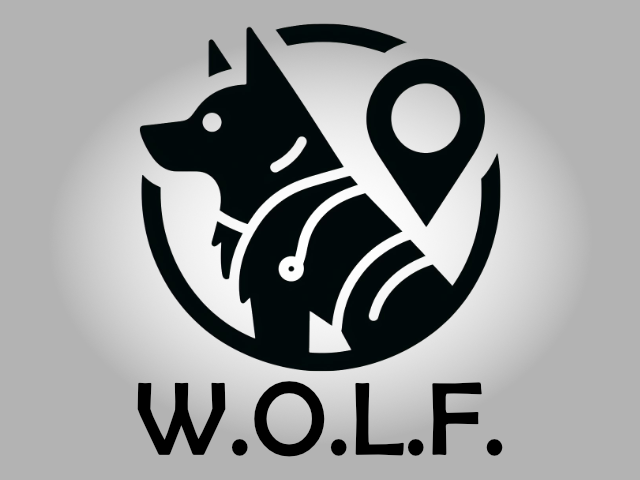
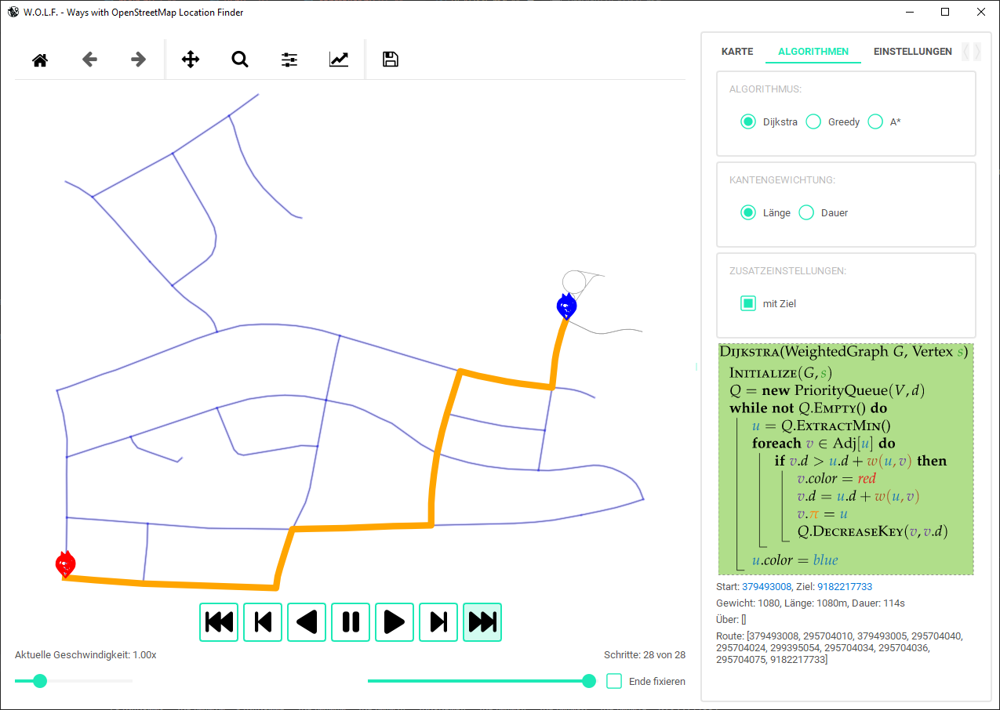

# Projekt W.O.L.F.
Projekt W.O.L.F. - Wege mit OpenStreetMap Lage Finder  
Projekt W.O.L.F. - Ways with OpenStreetMap Location Finder  
  


## Inhaltsverzeichnis
- [Beschreibung](#beschreibung)
- [Features](#features)
- [Projekt Anforderungen / Ziele](#projekt-anforderungen--ziele)
- [Anleitung](#anleitung)
    - [Ausführen](#ausführen)
    - [Theme ändern](#theme-umstellen)
- [Lizenzen](#lizenzen)
## Beschreibung
**Projekt W.O.L.F.** (Wege mit OpenStreetMap Lage Finder) ist als Projektarbeit anstelle eines Wahlpflichtfachs entstanden. Ziel ist eine grafischen Oberfläche zur Visualisierung von Pfadfindungsalgorithmen ,siehe [Projekt Anforderungen / Ziele](#projekt-anforderungen--ziele).

## Features
- **Allgemein**:
    - Setzen von *Start*, *Ziel* und *Routen* Punkten über Links-, Rechts- und Mittelklick
    - Schrittweise *Darstellung des Suchalgorithmus* über Steuerungs Buttons und Slider rechts
    - Setzen der *Animationsgeschwindigkeit* über Slider links
    - *Fixieren* der Schritte am Ende, Checkbox
    - [Themes](#theme-umstellen)
- Reiter **Karte**, erlaubt das Laden und Speichern einer *OpenStreetMap* Karte über
    - die Suche eines Namen, Button **"Setze Ort"**
    - Eingabe von Koordinaten einer Bounding Box, Button **"Setze Bbox"**
    - Durch Zoomen des aktuellen Kartenauschnitts, Button **"Setze Aktuelle Auswahl"**
    - Speichern in GraphML Format, über Button **"Speichere GraphML"**
    - anschließendes Laden der GraphML Datei, über Button **"Lade GraphML"**
- Reiter **Algorithmen**:
    - Auswahl zwischen Dijkstra, Greedy, A*
    - Kantengewichtung nach Strecken Länge oder Dauer
    - Zusatzeinstellungen: Dijkstra mit Ziel Ende, Greedy und A* Auswahl der Heuristik "0","Euclidean", "Euclidean²" oder "Manhattan"
    - Anzeige der Start, Ziel und Routen Punkte IDs
    - Anzeige des Gewichts, Länge und Dauer der gefunden Route
    - Anzeige der gefunden Route
- Reiter **Einstellungen**:
    - Kantenbeschriftung: Keine, Straßenname, Länge, Dauer
    - Knotenbeschrifung: Keine, OSM ID
    - Karten Hintergrund

## Projekt Anforderungen / Ziele
Entwicklung einer grafischen Oberfläche zur Visualisierung von Pfadfindungsalgorithmen.

| Anforderung | Umsetzung |
| --- | --- |
| Möglichkeit eine beliebige OSM zu laden und das Straßennetz zu extrahieren. | Name, Bbox, Zoom, GraphML 
| Unterschiedliche Darstellungsmöglichkeiten der Karte | Beschriftung + Hintergrund
| Erzeugung des Graphen | OSMnx
| Auswahl zwischen unterschiedlichen Algorithmen zum durchlaufen | Dijkstra, A*, Greedy
| Auswahl des Start und Zielknotens auf der Karte durch klicken (Erweiterbar auf mehrere Ziele, s.d. auch Routen erzeugt werden können) | Links-,Rechts-, Mittelklick
| Dijkstra, A*, Greedy, (optional Potentialfeldmethode, Routenplanung) | Dijkstra, A*, Greedy + Routen
| Visualisierung des Suchalgorithmus (Einzelne Schritte sukzessive darstellbar) | ✔
| Mögliche Programmiersprachen Python, C++, Java | Python + Qt
| Cross Plattform Kompatibilität (Windows, MacOS, Linux) | Python + Qt

## Anleitung
### Ausführen
#### 1. Virtenv erstellen
``` bash
python -m venv venv
```
#### 2. Virtenv aktivieren

##### Unter Linux:
``` bash
source venv/bin/activate
```

##### Windows:
``` ps
venv/Scripts/Activate.ps1
```
oder
``` bat
venv/Scripts/Activate.bat
```
PS Sktripte könnten deaktivert sein:
``` ps
Get-ExecutionPolicy
```
Als Admin:
``` ps
Set-ExecutionPolicy Unrestricted
```

#### 3. Abhänigkeiten installieren
``` bash
pip install -r requirements.txt
```
oder
``` bash
python -m pip install -r requirements.txt
```

#### 4. zum venv verlassen

``` bash
deactivate
```
#### 5. Programm starten
Im aktiven Virtenv
``` bash
python main.py
```
---
### Theme umstellen
#### main.py
``` python
    apply_stylesheet(app, theme='light_amber.xml', invert_secondary=True)
```
#### Mögliche Themes
- 'dark_amber.xml',
- 'dark_blue.xml',
- 'dark_cyan.xml',
- 'dark_lightgreen.xml',
- 'dark_pink.xml',
- 'dark_purple.xml',
- 'dark_red.xml',
- 'dark_teal.xml',
- 'dark_yellow.xml',
- 'light_amber.xml',
- 'light_blue.xml',
- 'light_cyan.xml',
- 'light_cyan_500.xml',
- 'light_lightgreen.xml',
- 'light_pink.xml',
- 'light_purple.xml',
- 'light_red.xml',
- 'light_teal.xml',
- 'light_yellow.xml'

## Lizenzen
[OpenStreetMap®](https://www.openstreetmap.org/copyright) sind offene Daten (open data), lizenziert unter der [Open Data Commons Open Database-Lizenz](https://opendatacommons.org/licenses/odbl/1) (ODbL) von der [OpenStreetMap Stiftung](https://osmfoundation.org/) (OSMF).

[OSMnx](https://osmnx.readthedocs.io/en/stable/) ist Open Source und lizenziert unter der MIT Lizenz.

[W.O.L.F.](https://github.com/georgmangold/wolf) wird lizenziert unter der [MIT Lizenz](https://choosealicense.com/licenses/mit/).